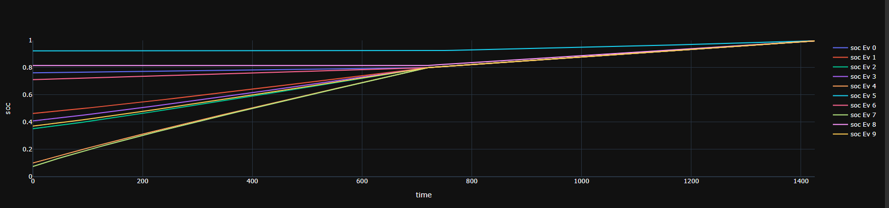
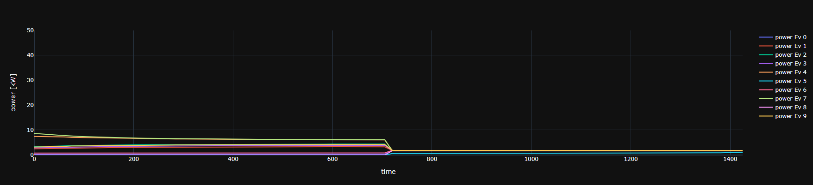
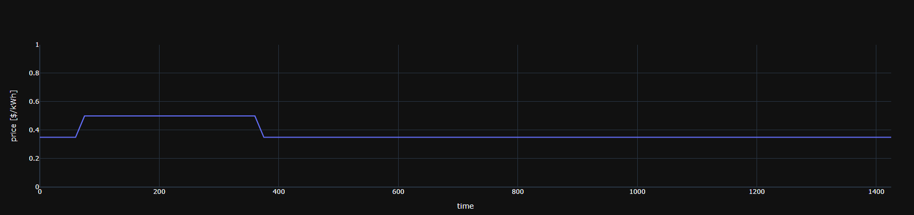
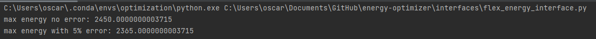
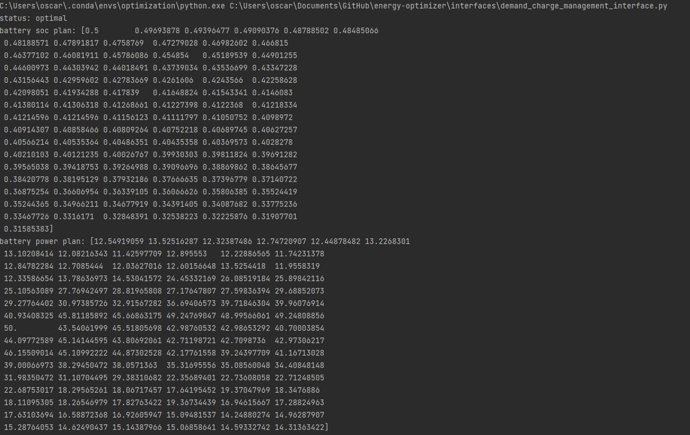

# Power and Energy Optimization Challenges

---
### Challenge code for TOU, Demand Charges and Day-Ahead Energy Bidding Optimization. This project has two main `src` folders, one is `model` and the other one is `interfaces`. 
### The `model` has the optimization models for the three challenges, the `core` class is used as a `base` class for `time series` and `scalar` variables.
### The `interface` folder has interfaces to easily access the models and solvers. A third folder, `notebooks`, has Jupyter Notebooks that show how models are run for the applications.
---

### Challenge 1: EV Fleet Optimization 

On this challenge, an `Ev` model and `Fleet` model are utilized. The `Ev` has the following parameters:
- Rated energy or capacity of Ev in kWh.
- Rated power or maximum charging power in kW.
- Charging efficiency.
- Start SoC.
- SoC derating or max SoC before derating power. 

The `Ev` model combines four continuous variables and one integer:
- energy_state: energy state of the battery in kWh
- soc: soc state of the battery from 0 to 1.
- power_state: power state of the battery in kW.
- energy_in: this represents the interval of energy absorbed.
- above_max_soc_derating: boolean or integer which represents when the battery is being derated.

Both `Ev` and `Fleet` share the same `dt` parameter which is the index of time series data but each position is the timedelta between timestamps in seconds.
The `Ev` model uses previous parameters and variables to establish the constraints which define the physical modeling. 

The `Fleet` is an aggregation of `Ev` objects and it is initialized with the following parameters:
- time_range: datetime range of dates
- ev_capacity: number of Ev's in the fleet
- peak_demand_cost: cost of peak power ($/kW)
- peak_energy_cost: cost of energy during peak hours ($/kWh)
- normal_energy_cost: cost of energy during non-peak hours ($/kWh)
- initial_soc_list: list of initial SoC states of Evs in the list
- slow_charge_cost: cost for slowly charging the cars which incentives charging them as quickly as possible
- ev_list: list of `Ev` objects
- energy_price_vector: variable cost of energy vector in time

The optimization variables of the fleet are:
- total_energy_in: aggregation of energy_in states for evs in the list
- total_power_state: aggregation of total power for evs in the list

With previous parameters and variables, the constraints are build which are simply the aggregation of Ev objects.
Then the objectives of the optimization are:
1. Minimize energy cost due to variable pricing.
2. Minimize peak demand.
3. Minimize the cost of charging evs slowly.

The `fleet` class is used on the `ev_fleet_optimization` notebook to show the use case of 10 cars being charged within 24 hours. 
These are some images of the results:

In this image the SoC of each Ev is shown as they approach the end of the horizon. A hard constrained exists to take each ev 
to at least 80% in the first 12 hours.

This image shows the charging profiles of the evs. The optimization flattens their power to avoid a high penalty due to demand.

This image can be compared with the previous one to show how the optimization prologues the charging so some energy is paid on normal pricing and not peak pricing. 

The idea behind this implementation is that the schedule of the evs are calculated everyday after they arrive back at the charging facility. Harder constriants must be imposed to accelerate the chrging to a few hours so they leave the facility as soon as possible. Once they arrive back at a certain hour, their new schedules are calculated based on the amount of usage of the day and their current state of charge.

---

### Challenge 2: Flex energy in portfolio

On this challenge, a `Battery` model and `Portfolio` model are utilized. The `Battery` has the following parameters:
- Rated energy or capacity of Battery in kWh.
- Rated power or maximum charging and discharging power in kW.
- Final state of energy.

The `Battery` model combines three continuous variables:
- energy_state: energy state of the battery in kWh
- power_state: power state of the battery in kW.
- energy_flow: this represents the interval of energy absorbed or delivered.

Both `Battery` and `Portfolio` share the same `dt` parameter which is the index of time series data but each position is the timedelta between timestamps in seconds.
The `Battery` model uses previous parameters and variables to establish the constraints which define the physical modeling. 

The `Portfolio` is an aggregation of `Battery` objects and it is initialized with the following parameters:
- sites_capacity: number of sites in the portfolio
- pv_forecast: total forecasted solar energy (kWh)
- load_forecast: total forecasted energy demand (kWh)
- baseline_da: total baseline load energy for day ahead (kWh)
- battery_list: list of `Battery` objects

The optimization variables of the fleet are:
- total_energy_flow: aggregation of energy in and out per interval

With previous parameters and variables, the constraints are build which are simply the aggregation of Battery objects.
The objective of the optimization is to estimate the maximum flex energy; the result accepts a margin of error to estimate expected energy within 95% confidence.

An example result of this optimization is shown in `interfaces/flex_energy_interface.py` which estimates max flex energy for a portfolio
of 5 residential sites with 100 kWh battery each and a series of energy parameters. Furthermore, the interface and example shows a 
result considering a 5% margin of error for the load and solar forecasts. The following is a printout of the execution of the example:

---

### Challenge 3: Demand Charge Management Optimization

On this challenge, an enhanced `EnhancedBattery` model is utilized. The `EnhancedBattery` has the following parameters:
- Rated energy or capacity of Battery in kWh.
- Rated power or maximum charging power in kW.
- Charging efficiency.
- Discharging efficiency.
- Start SoC.

The `EnhancedBattery` model uses seven continuous variables:
- energy_state: energy state of the battery in kWh
- soc: soc state of the battery from 0 to 1.
- power_state: power state of the battery in kW.
- charge: charge power.
- discharge: discharge power.
- energy_in: incoming energy in current interval.
- energy_out: outgoing energy in current interval.

With previous parameters and variables, an interface `DCMOptimizer` is used to initialize the `EnhancedBattery` model and use load data to calculate a battery schedule.
The objective of the optimization is to minimize demand by discharging the battery in periods of high demand, and charging the battery in periods of low demand.

An example result of this optimization is shown in `interfaces/demand_charge_management_interface.py` which estimates the optimal schedule for a complete day of the load data. This interface should be further improved to accept any month input and obtain optimal battery schedules for such input.
The following is a printout of the execution of the example:

